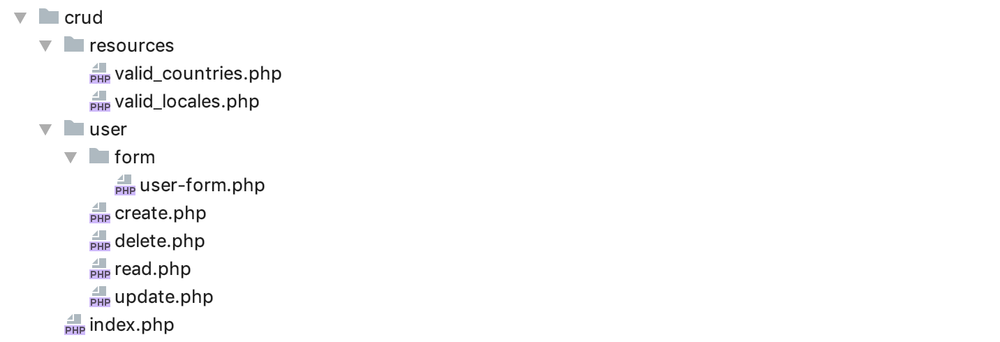
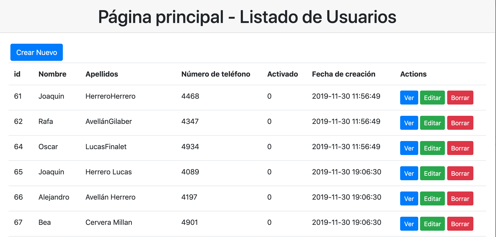

# UD3.3 Operaciones CRUD (CREATE, READ, UPDATE Y DELETE)

# Actividad 13 - Introducción
A lo largo de la práctica crearemos una aplicación simple que nos permita llevar a cabo el alta, modificación, borrado y 
búsqueda de usuarios de la base de datos `crm_db` con la cual hemos trabajado en las actividades anteriores.
Con el objetivo de tener nuestra aplicación bien organizada, crearemos un directorio llamado **crud** que contendrá los 
diferentes ficheros de la aplicación.

La estructura de directorios y archivos que debemos crear es:



- **index.php** - Listado de usuarios con enlaces a las diferentes páginas que permitirá gestionar cada uno de ellos.
- **user/create.php** - Contiene el formulario de alta de un usuario y su procesamiento.
- **user/delete.php** - Contiene el formulario de alta de un usuario y su procesamiento.
- **user/read.php** - Contiene la página que nos permitirá consultar el detalle de un usuario
- **user/update.php** - Contiene el formulario de modificación de datos de un usuario y su procesamiento.
- **user/form/user-form.php** - Contiene solo la vista del formulario 'html' que será utilizado tanto en el alta de usuarios 
como en su modificación.
- **user/form/user_locales.php** - Contiene la lista de locales válidos para los usuarios de la aplicación
- **resources/valid_countries.php** - Contiene el listado de paises válidos para las empresas de la aplicación
```php
<?php

return [
    "es" => "España",
    "pt" => "Portugal",
    "it" => "italia",
    "fr" => "Francia",
    "ch" => "China",
    "gb" => "Gran Bretaña",
    "us" => "Estados Unidos"
];
```
```php
<?php
return [
    "ca_ES" => "Catalán (España)",
    "es_ES" => "Español (España)",
    "es_Ar" => "Español (Argentina)",
    "it_IT" => "italia",
    "fr_FR" => "Francia",
    "en_GB" => "China",
    "en_US" => "Gran Bretaña",
];
```

# 1. Página inicial
Crearemos una página inicial `index.php`, que constituirá el **punto de acceso** a la aplicación, y la que nos va a permitir
seleccionar cada uno de los usuarios para llevar a cabo acciones con ellos.

Como podrás observar en el siguiente `snippet`de código, hemos hecho uso del framework **bootstrap** para
proporcionar un aspecto más agradable a la aplicación. Puedes modificar el aspecto consultanbdo la
**[documentación oficial](https://getbootstrap.com)** o incluso no utilizarlo para resolver la práctica



**/index.php**
```php

<!doctype html>

<html lang="en">
<head>
    <meta charset="utf-8">
    <title>CRM DB CRUD</title>
    <link rel="stylesheet" href="https://stackpath.bootstrapcdn.com/bootstrap/4.4.1/css/bootstrap.min.css">
</head>
<body>
<div class="card">
    <h1 class="card-header text-center">
        Página principal - Listado de Usuarios
    </h1>
    <div class="card-body">
        <a class="btn btn-primary m-1" href="/crud/user/create.php?">Crear Nuevo</a>
        <?php
        
        include __DIR__ ."/../funciones/actividad11/repositorio_usuario_pdo.php";

        $listadoUsuarios = obtenerTodosLosUsuarios(6);

        echo "<table class='table'>";
        echo "<tr>
          <th>id</th>
          <th>Nombre </th>
          <th>Apellidos</th>
          <th>Número de teléfono</th>
          <th>Activado</th>
          <th>Fecha de creación</th>
          <th>Actions</th>
        </tr>";

        foreach ($listadoUsuarios as $row) {
            echo "<tr>
             <td>{$row['id']}</td>
             <td>{$row['firstName']}</td>
             <td>{$row['lastName']}</td>
             <td>{$row['phoneNumber']}</td>
             <td>{$row['active']}</td>
             <td>{$row['createdOn']}</td>
             <td><a class='btn btn-primary btn-sm' href=\"/crud/user/read.php?id={$row['id']}\">Ver</a>
             <a class='btn btn-success btn-sm' href=\"/crud/user/update.php?id={$row['id']}\">Editar</a>
             <a class='btn btn-danger btn-sm' href=\"/crud/user/delete.php?id={$row['id']}\">Borrar</a></td>
          </tr>";
        }

        echo "</table>";

        ?>
    </div>
</div>
</body>
```
~~~
   Recuerda que esta página hace uso del **repositorio_usuario_pdo** por lo que deberás sustituir la inclusión del fichero
   por la ruta en la que se encuentre el fichero que desarrollaste en los ejercicios anteriores.
~~~

# 2. Página de detalle

Cómo podemos ver en la página inicial tenemos un enlace representado por un botón que nos enviará a una página `read.php`, 
situada en el path `/crud/user/read.php` a la que pasaremos como argumento el `id del usuario del que queremos obener la información.

```php
   <td><a class='btn btn-primary btn-sm' href=\"/crud/user/read.php?id={$row['id']}\">Ver</a>
```

**/user/read.php**
```php

<?php

include __DIR__ ."/../../funciones/actividad11/repositorio_usuario_pdo.php";

$userId = $_GET['id'];

echo "<h2>Detalle de Usuario $userId</h2>";
echo "<p><a href='/crud/index.php'>Volver al Listado</a></p>";

$usuario = buscarUsuario($userId);

if ($usuario){
        echo "<ul>
            <li>Id: {$usuario['id']}</li>
            <li>Nombre: {$usuario['firstName']}</li>
            <li>Apellidos: {$usuario['lastName']}</li>
            <li>Telefono: {$usuario['phoneNumber']}</li>
            <li>Activo: {$usuario['active']}</li>
            <li>Fecha de Creación: {$usuario['createdOn']}</li>
            <li>id de Empresa: {$usuario['idEnterprise']}</li>
            <li>Cumpleaños: {$usuario['birthday']}</li>
         </ul>";
} else {

    echo "<p>Usuario no encontrado</p>";

}

```
# 3. Página de borrado
Cómo podemos ver en la página inicial tenemos un enlace representado por un botón para borrar una usuario de la base de datos.
Este enlace nos envia a la ejecución de la página `delete.php`, situada en el path `/crud/user/delete.php` a la que pasamos
como argumento el `id` del usuario que queremos borrar.

```php
  <a class='btn btn-danger btn-sm' href=\"/crud/user/delete.php?id={$row['id']}\">Borrar</a>
```

**/user/delete.php**
```php
<?php

include __DIR__ ."/../../funciones/actividad11/repositorio_usuario_pdo.php";

$userId = $_GET['id'];

echo "<h2>Borrado suario $userId</h2>";
echo "<p><a href='/crud/index.php'>Volver al Listado</a></p>";

if (borrarUsuario($userId)) {

    echo "<p>Usuario borrado correctamente</p>";

} else {

    echo "<p>El usuario no se ha podido borrar</p>";

}
```
# 3. Página de inserción
La página de inserción de los usuarios de la base de datos necesitará un formulario de inserción y su correspondiente 
validación, de forma que solo se lleve a cabo la inserción si los datos introducidos son correctos.
A continuación se presenta el formulario con una validación básica en la que simplemente se comprueban que los datos existen.
~~~
Con el fin de evitar la duplicidad de código se creaá una vista parcial del formulario en un archivo independiente para que este pueda
ser utilizado tanto en inserción como en la modificación.
~~~

**/user/create.php**
```php
<?php

$usuario = [
    'id' => (isset($_POST['id'])) ? $_POST['id'] : null,
    'firstName' => (isset($_POST['firstName'])) ? $_POST['firstName'] : null,
    'lastName' => (isset($_POST['lastName'])) ? $_POST['lastName'] : null,
    'email' => (isset($_POST['email'])) ? $_POST['email'] : null,
    'phoneNumber' => (isset($_POST['phoneNumber'])) ? $_POST['phoneNumber'] : null,
    'locale' => (isset($_POST['locale'])) ? $_POST['locale'] : null,
    'birthday' => (isset($_POST['birthday'])) ? $_POST['birthday'] : null,
    'idEnterprise' => (isset($_POST['idEnterprise'])) ? $_POST['idEnterprise'] : null,
    'active' => (isset($_POST['active'])) ? $_POST['active'] : 0
];

if ($_SERVER['REQUEST_METHOD'] == "POST") {

    if ($usuario['firstName']
        && $usuario['lastName']
        && $usuario['email']
        && $usuario['phoneNumber']
        && $usuario['locale']
        && $usuario['birthday']
        && $usuario['idEnterprise']) {

        require __DIR__ . "/../../funciones/actividad11/repositorio_usuario_pdo.php";

        $usuario['password'] = password_hash("cambiame", PASSWORD_BCRYPT);

        if ($usuarioInsertado = insertarUsuario($usuario)) {
            echo "<p>Usuario insertado correctamente</p>";
            $usuario = $usuarioInsertado;
        }

    } else {
        echo "<p>Revise los campos obligatorios";
    }

}

include __DIR__ . "/form/user-form.php";
```
**/user/form/user-form.php**

```php
<form action="<?=$_SERVER['PHP_SELF']?>" method="post">
    <div>
        <label for="id">Id</label>
        <input type="text" name="id" value="<?=$usuario['id']?>" readonly>
    </div>
    <div>
        <label for="firstName">Nombre</label>
        <input type="text" name="firstName" value="<?=$usuario['firstName']?>">
    </div>
    <div>
        <label for="lastName">Apellidos</label>
        <input type="text" name="lastName" value="<?=$usuario['lastName']?>">
    </div>
    <div>
        <label for="email">Email</label>
        <input type="text" name="email" value="<?=$usuario['email']?>" <?=(isset($edit) ? 'readonly' : '')?>>
    </div>
    <div>
        <label for="phoneNumber">Telefono</label>
        <input type="text" name="phoneNumber" value="<?=$usuario['phoneNumber']?>">
    </div>
    <div>
        <label for="locale">Locale</label>
        <select name="locale">
            <option value="">Seleccione una opción</option>
            <?php
                $listadoLocales = require __DIR__ . "/../../resources/valid_locales.php";
                foreach ($listadoLocales as $iso => $localeName ){
                    if ($iso == $usuario['locale']) {
                        echo " <option selected value=\"$iso\">$localeName</option>";
                    } else {
                        echo " <option  value=\"$iso\">$localeName</option>";
                    }
                }
            ?>
        </select>
    </div>
    <div>
        <label for="birthday">Fecha Nacimiento</label>
        <input type="date" name="birthday" value="<?=$usuario['birthday']?>">
    </div>
    <div>
        <label for="idEnterprise">IdEnterprise</label>
        <input type="text" name="idEnterprise" value="<?=$usuario['idEnterprise']?>" <?=(isset($edit) ? 'readonly' : '')?>>
    </div>
    <div>
        <label for="active">Activo</label>
        <input <?=($usuario['active']) ? 'checked': ''?> type="checkbox" name="active" value="1">
    </div>
    <div>
        <input type="submit" value="Guardar">
        <a href="/crud/index.php"><input type="button" value="Cancelar"></a>
    </div>
</form>
```

# 4. Página de Modificación
La página de modificación recibirá el `id` del usuario sobre el que se va a llevar la acción, el procedimiento a seguir es:
1. Consultamos en la base de datos la información actual del usuario y la mostramos en el formulario 
2. Marcaremos en el `html` como `no editables aquellos campos que no queremos que se modifiquen en la base de datos.
3. Cuando el usuario pulse sobre el botón `modificar` debemos comprobar que todos sean correctosm en cuyo caso llevaremos a cabo
la inserción en la base de datos.

**/user/update.php**
```php
<?php

echo "<p><a href='/crud/index.php'>Volver al Listado</a></p>";

$edit = true;

if ($_SERVER['REQUEST_METHOD'] == "GET") {

    $idUser = $_GET['id'];

    if ($idUser) {

        require __DIR__ . "/../../funciones/actividad11/repositorio_usuario_pdo.php";
        $usuario = buscarUsuario($idUser);

    }

} else {


    $usuario = [
        'id' => (isset($_POST['id'])) ? $_POST['id'] : null,
        'firstName' => (isset($_POST['firstName'])) ? $_POST['firstName'] : null,
        'lastName' => (isset($_POST['lastName'])) ? $_POST['lastName'] : null,
        'email' => (isset($_POST['email'])) ? $_POST['email'] : null,
        'phoneNumber' => (isset($_POST['phoneNumber'])) ? $_POST['phoneNumber'] : null,
        'locale' => (isset($_POST['locale'])) ? $_POST['locale'] : null,
        'birthday' => (isset($_POST['birthday'])) ? $_POST['birthday'] : null,
        'idEnterprise' => (isset($_POST['idEnterprise'])) ? $_POST['idEnterprise'] : null,
        'active' => (isset($_POST['active'])) ? $_POST['active']: 0
    ];
    if ($usuario['id']
        && $usuario['firstName']
        && $usuario['lastName']
        && $usuario['email']
        && $usuario['phoneNumber']
        && $usuario['locale']
        && $usuario['birthday']
        && $usuario['idEnterprise']) {

        require __DIR__ . "/../../funciones/actividad11/repositorio_usuario_pdo.php";

        if (modificarUsuario($usuario)) {
            echo "<p>Usuario modificado correctamente</p>";
        }
    } else {
        echo "<p>Revise los campos obligatorios";
    }

}

include __DIR__ . "/form/user-form.php";
```

# 5. Trabajo a Realizar

**A)** Crea la aplicación descrita paso a paso

**B)** Crea un directorio `empresas` y modifica la aplicación para que nos permita crear, modificar, borrar y leer empresas.

**C)** (Opcional) Añade estilo a las diferentes páginas utilizando el framework **[bootstrap](https://getbootstrap.com)**
