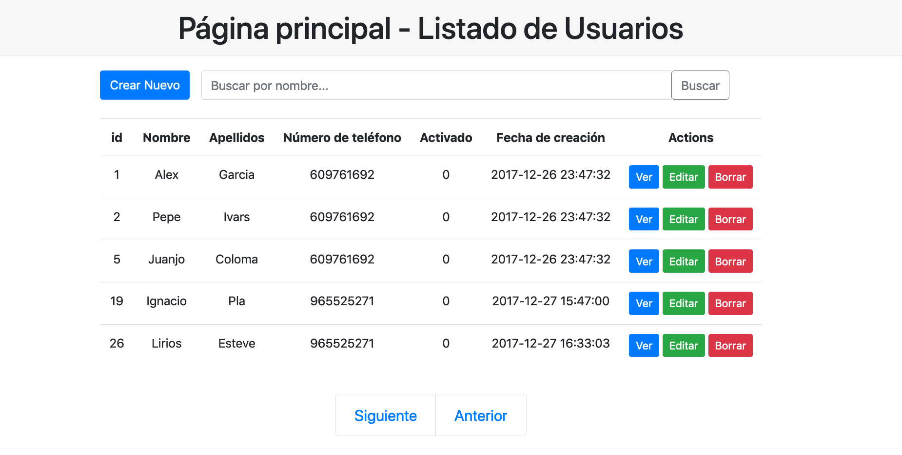

# UD3.4 Acceso a la información. Paginación

## Actividad 14 - Introducción

Uno de los problemas con los que nos enfrentamos en la construcción de aplicaciones es el acceso a la información
almacenada, sobretodo en arquitecturas centralizadas como son las arquitecturas `cliente-servidor`.

El acceso a la información debe llevarse a cabo de forma segmentada y de acuerdo a las necesidades de los usuarios
que hacen uso de la aplicación. 

En estos ejercicios presentaremos las técnicas de páginación en el acceso a la información. El objeto final será el mostrado
por la siguiente imagen:



## 1. Paginación

  Para llevar a cabo la paginación de un listado de usuarios deberemos conocer:
  
- **Tamaño de página**: Número de elementos que queremos mostrar en cada página y que nos permitira llevar a cabo
las consultas correspondientes a la base de datos a través del modificador `LIMIT offset,numElements`.

```sql
   SELECT * FROM User LIMIT 0, 15 #obtenemos página 1
```
```sql
   SELECT * FROM User LIMIT 15, 15 #obtenemos página 2
```

```sql
   SELECT * FROM User LIMIT 30, 15 #obtenemos página 3
```

- **Número total de elementos:** nos permitirá mostrar los botones correspondientes al usuario para que navegue 
por las páginas hacia delante o hacia atrás según la página en la que nos encontramos y si existen más elemento o no.

El código para los botones utilizando el `framework bootstrap` sería el siguiente:

```php
<div class="row mx-auto">
     <nav aria-label="...">
          <ul class="pagination pagination-lg">
              <li class="page-item"><a class="page-link" href="/CRUD/index?page=1">Anterior</a></li>
              <li class="page-item"><a class="page-link" href="/CRUD/index?page=2">Siguiente</a></li>
          </ul>
     </nav>
</div>
```

Desde el punto de vista del acceso a la base de datos, deberemos recoger el parámetro `page `y llevar a cabo 
la consulta correspondiente.

## 2. Filtrado de datos
El filtrado de datos se lleva a cabo con el fin de que el usuario pueda encontrar la información buscada, el mecanismo para su 
implementación consiste en la utilización de un formulario en el que cada uno de sus campos serán parámetros pasados por 
el método `get y que desde el servidor deberemos recuperar para utilizarlos en la consulta correspondiente a la base de de datos.

El código utilizando el `framework bootstrap` para la vista podría ser el siguiente:

```php
<form class="col-lg-10 mx-auto" action="#">
    <div class="active-red-3 input-group mb-4">
       <input class="form-control" type="text" name="q" placeholder="Buscar por nombre..." aria-label="Buscar nombre...">
       <button class="btn btn-outline-secondary bg-danger" type="submit">
            <span class="fa fa-search form-control-feedback"></span>
       </button>
    </div>
</form>
```

## 3. Trabajo a realizar
A) Modifica el fichero `repositorio_usuario_pdo.php` y añade una función `obtenerListadoUsuarios. El tamaño de página
será de 15.

```php
<?php

function obtenerListadoUsuarios(int $page, int $pageSize = 15): array
{
    $offset = $pageSize * $page;
    $sql = "SELECT * FROM User LIMIT $offset,$page";
    ...
}
```

B) Añade un filtro mediante un formulario que nos permita llevar a cabo la búsqueda de usuarios a partir de su nombre.

Deberás crear un nueva función en el fichero `repositorio_usuario_pdo.php` que nos permita obtener de forma páginada
los usuarios cuyo título coincida con el string pasado como argumento
será de 15.

```php
<?php
function obtenerListadoUsuarios(String $queryString, int $page, int $pageSize): array
{
    $offset = $pageSize * $page;
    $sql = "SELECT * FROM User WHERE firstName LIKE "%$queryString%" LIMIT $offset,$page";
    ...
}
```


